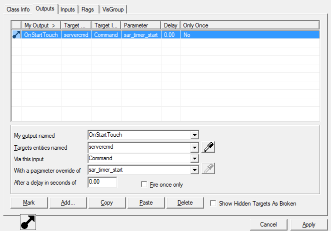
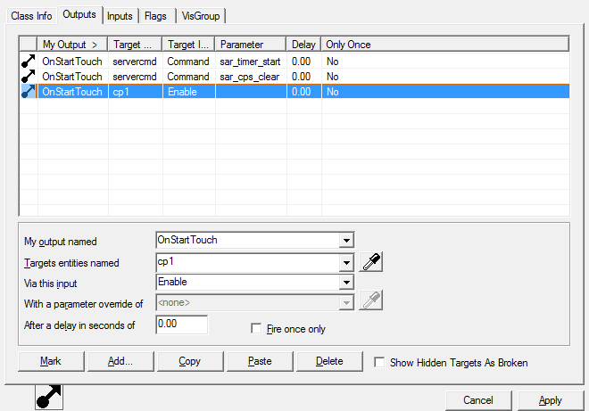

**SourceAutoRecord** allows automatic demo recording, automatic binding, demo parsing, session timing and [much more](#features).

## Overview
- [Supported Games](#supported-games)
- [Features](#features)
  - [Automatic Demo Recorder](#automatic-demo-recorder)
  - [Automatic Binding](#automatic-binding)
  - [Demo Parser](#demo-parser)
  - [Session Timing](#session-timing)
    - [Summary](#summary)
  - [Timer](#timer)
    - [Average](#average)
    - [Checkpoints](#checkpoints)
  - [HUD](#hud)
  - [Cheats](#cheats)
  - [Patches](#patches)
- [Mapping](#mapping)
 - [Start & Stop Triggers](#start--stop-triggers)
 - [With Checkpoints](#with-checkpoints)
- [Credits](#inspired-by)

## Supported Games
- Portal 2

## Features

### Automatic Demo Recorder
- Tells the engine to keep recording when loading from a save
- `stop` disables automatic recording

### Automatic Binding
- `sar_bind_save <key> [save_name]` binds automatically `save save_name` to the given key when loading
- `sar_save_flag [echo_message]` appends `;echo message` to the save bind
- `sar_bind_reload <key> [save_name]` binds automatically `save save_name;reload` to the given key when loading
- `sar_unbind_save` unbinds the key and stops automatic binding for `sar_bind_save`
- `sar_unbind_reload` unbinds the key and stops automatic binding for `sar_bind_reload`
- Save files will be named _2, _3, etc.
- File indexing will be synced automatically with the demo recorder when recording with demos

### Demo Parser
- `sar_time_demo [demo_name]` parses a demo and prints some useful information about it
- Passing an empty string `sar_time_demo ""` will take the last demo from demo recorder or demo player
- `sar_time_demo_dev` prints demo's console commands and packets when using `sar_time_demo`
- Use `con_log [file_name]` to export the extra data into a file
- `sar_time_demos [demo_name] [demo_name2] [etc.]` parses multiple demos

### Session Timing
- `sar_session` prints the current tick count since the server has loaded

#### Summary
- `sar_sum_here` starts saving the total tick count of each session
- `sar_sum_stop` stops counting
- `sar_sum_reset` resets the counter
- `sar_sum_result` prints the result of all saved sessions
- `sar_sum_during_session` counts current session too

### Timer
- `sar_timer_start` starts or restarts the timer, counting from invocation
- `sar_timer_stop` stops timer
- `sar_timer_result` prints result
- Mappers can use this for accurate timing, [see below](#mapping)

#### Average
- `sar_avg_start` starts calculating the average of the timer
- `sar_avg_stop` stops calculation
- `sar_avg_result` prints result

#### Checkpoints
- `sar_cps_add` saves current timer value
- `sar_cps_clear` resets all saved values
- `sar_cps_result` prints result of all checkpoints

### HUD
- Drawing useful information with `cl_showpos`
- `sar_draw_session` draws current session value
- `sar_draw_sum` draws summary value of sessions
- `sar_draw_timer` draws timer value
- `sar_draw_avg` draws current average of timer
- `sar_draw_cps` draws last checkpoint value of timer
- `sar_draw_demo` draws current name, tick and time of demo recorder

### Cheats
- `sar_autojump` enables tick-perfect jumping on the server
- `sv_bonus_challenge`, `sv_accelerate`, `sv_airaccelerate`, `sv_friction`, `sv_maxspeed` and `sv_stopspeed` can be accessed in the developer console

### Patches
- Limited character printing has been extended for `help`
- Redundant command execution has been removed for `playdemo`

## Mapping

### Start & Stop Triggers
- Place a `point_servercommand` object anywhere in the map
- Use two `trigger_multiple` objects for start and stop
  - Add `OnStartTouch` as output
  - Target the created servercommand object
  - Select `Command` as input
  - Use `sar_timer_start` as parameter
  - Do the same for the second trigger with `sar_timer_stop`

### With Checkpoints
- Use `trigger_multiple` object for start
  - Trigger `sar_timer_start`
  - Trigger `sar_cps_clear`
  - Enable checkpoint object
- Use `trigger_multiple` object for checkpoint
  - Trigger `sar_cps_add`
  - Disable itself
- Use `trigger_multiple` object for stop
  - Trigger `sar_timer_stop`

## Inspired By
- [SourcePauseTool](https://github.com/YaLTeR/SourcePauseTool)
- [SourceDemoRender](https://github.com/crashfort/SourceDemoRender)
- [SourceSplit](https://github.com/fatalis/SourceSplit)